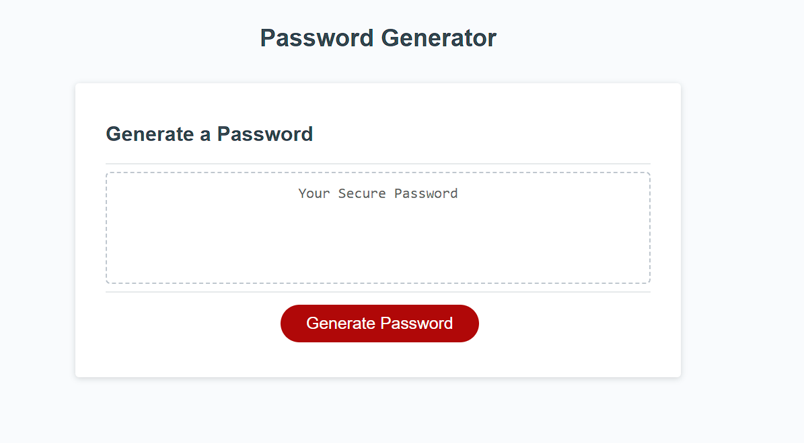

# <03 Password Generator>

## Description

The modifications to this website include adding functionality to a password generator. The generate password button can be used to trigger prompts for criteria, like password length (within 8-128 characters). The user can also choose whether to include lowercase, uppercase, numeric, or special characters, but is required to include at least one character type once all the prompts are answered. Then the password that meets the criteria is generated and displayed on the page.

## Table of Contents

- [Installation](#installation)
- [Usage](#usage)
- [Credits](#credits)
- [License](#license)
- [Features](#features)
- [How to Contribute](#how-to-contribute)
- [Tests](#tests)

## Installation

N/A

## Usage

Here is the link: https://gisellerx.github.io/password-generator/

## Credits

Giselle Reyes

## License

## Features

Password generator

## How to Contribute

Personal challenge

## Tests

Used VS Code
